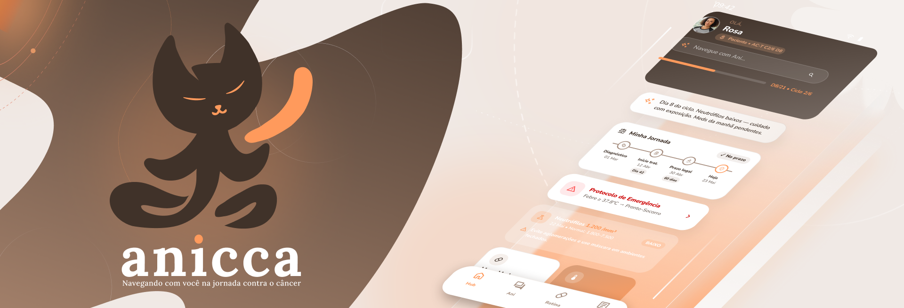

# 🤎 Anicca – Hub de Navegação Oncológica

> *"Navegando com você na jornada contra o câncer"*

[](https://typescriptlang.org)
[](https://expo.dev)
[](https://nextjs.org)
[](https://fastapi.tiangolo.com)
[](.)

<p align="center">
  <br />
  
  <br />
</p>

## 🎗️ Sobre o Projeto

A **Anicca** é um hub de navegação oncológica conversacional que centraliza **WhatsApp, app e web** em uma experiência única — guiada pela **Ani**, uma IA com memória de contexto persistente que acompanha pacientes, cuidadores e médicos do diagnóstico ao pós-tratamento.

---

## 🏗️ Arquitetura

Este projeto segue os princípios da **Clean Architecture** combinada com **Feature-Sliced Design (FSD)** no frontend e um **BFF (Backend For Frontend)** robusto:

```text
anicca/
├── apps/
│   ├── api/                    # BFF FastAPI (Python)
│   │   ├── src/
│   │   │   ├── domain/         # Entidades puras e Regras de Negócio
│   │   │   ├── application/    # Casos de Uso (LangGraph, Agentes)
│   │   │   ├── infrastructure/ # Repositórios (Postgres), Webhooks (Whatsmiau)
│   │   │   └── presentation/   # Endpoints da API REST
│   │   └── alembic/            # Versionamento de Banco de Dados
│   │
│   └── mobile/                 # App React Native (Expo)
│       └── src/
│           ├── app/            # Roteamento (Expo Router v4)
│           ├── pages/          # Telas (Onboarding, Hub, Rotina)
│           ├── features/       # Lógica e componentes isolados por domínio (FSD)
│           └── shared/         # Design System, Hooks e Utilitários globais
│
└── docs/                       # Documentação Oficial (Contexto, Padrões, ADRs)
```

---

## 🚀 Tecnologias Utilizadas

### Core Frontend
- **React Native / Expo** - Framework multiplataforma
- **Expo Router v4** - Roteamento file-based declarativo
- **NativeWind v4** - Estilização utility-first baseada em Tailwind CSS
- **Zustand** - Gerenciamento de estado global leve
- **React Query** - Gerenciamento de estado de servidor e cache

### Core Backend & Inteligência Artificial
- **FastAPI (Python)** - Framework web de alta performance assíncrona
- **LangGraph** - Orquestrador de fluxo de múltiplos agentes stateful
- **Google Gemini 2.5 API** - LLM central e processamento de Visão (OCR)
- **Whatsmiau** - Webhooks para integração contínua com WhatsApp

### Dados & Infraestrutura
- **PostgreSQL + pgvector** - Persistência relacional e buscas semânticas vetoriais
- **Redis** - Armazenamento temporário de sessões e memória do agente
- **Alembic** - Migrações de banco de dados
- **Docker** - Conteinerização e ambiente isolado

---

## 🛠️ Como Executar

### Pré-requisitos
- Node.js (v20.0.0+)
- pnpm (v9.0.0+)
- Docker e Docker Compose

### Instalação e Execução

1. **Clone o repositório:**
```bash
git clone https://github.com/evamyuu/anicca.git
cd anicca
```

2. **Instale as dependências raiz:**
```bash
pnpm install
```

3. **Configure as variáveis de ambiente:**
```bash
cd apps/api
cp .env.example .env
# Edite o .env para adicionar suas credenciais (Gemini API, Whatsmiau, etc.)
```

4. **Suba os serviços backend:**
```bash
docker compose up -d
docker exec anicca-api alembic upgrade head
```

---

## 👥 Equipe
 
Agradecemos às seguintes pessoas que contribuíram para este projeto:
 
<table>
  <tr>
    <td align="center">
      <a href="https://github.com/evamyuu">
        <br>
        <sub><b>evamyuu</b></sub>
      </a><br/>
      <sub>Full-Stack · IA + UX/UI</sub>
    </td>
    <td align="center">
      <a href="https://github.com/vncys">
        <br>
        <sub><b>donax</b></sub>
      </a><br/>
      <sub>Full-Stack · Infra + UX/UI</sub>
    </td>
  </tr>
</table>
 
---
 
## 🤝 Como Contribuir
 
Anicca é um projeto acadêmico open source. A melhor forma de contribuir é abrindo issues com sugestões ou bugs encontrados.
 
- **Issues**: Descreva o problema ou sugestão
- **Pull Requests**: Fork → branch → PR com descrição clara
---
 
## 📝 Licença
 
Este projeto está sob licença MIT. Veja o arquivo [LICENSE](LICENSE) para mais detalhes.
 
---
 
<div>
  <p>Desenvolvido com 🤎 por Anicca</p>
</div>